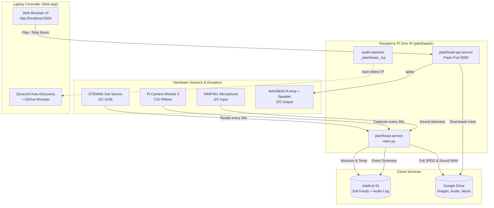

# PlantHead: Complete End-to-End System Guide

**PlantHead** is an IoT biosensing and interactive soundscape platform for multi-device, multi-country botanical environments. Each unit collects soil vitals, captures high-resolution imagery, listens for ambient sound events, and plays soundscapes via an onboard speaker controlled over the local network.

---

## Table of Contents
1. [System Architecture](#1-system-architecture)
2. [Hardware & Wiring Specifications](#2-hardware--wiring-specifications)
3. [Cloud Services Configuration](#3-cloud-services-configuration)
   - Adafruit IO Setup
   - Google Drive OAuth Setup
4. [Raspberry Pi OS Initial Setup](#4-raspberry-pi-os-initial-setup)
5. [Firmware Installation & Deployment](#5-firmware-installation--deployment)
   - Configuration (`.env`)
   - Hardware Diagnostics (`test_hardware.py`)
   - Background Services (`systemd`)
6. [Zero-SD-Card Storage Policy](#6-zero-sd-card-storage-policy)
7. [Laptop Controller Web Application](#7-laptop-controller-web-application)
8. [Multi-Device Scaling (`planthead1` to `planthead5`)](#8-multi-device-scaling)
9. [Operational Cheat Sheet & Troubleshooting](#9-operational-cheat-sheet--troubleshooting)

---

## 1. System Architecture



---

## 2. Hardware & Wiring Specifications

### 2.1 Microcontroller
* **Model**: Raspberry Pi Zero W (or Pi Zero 2 W)
* **Architecture**: 32-bit ARMv6 (Pi Zero W)
* **Operating System**: **Raspberry Pi OS Lite (32-bit)** Bookworm

### 2.2 GPIO Pinout Table

| Peripheral | Sensor / Module Pin | Pi Physical Pin | Pi Header Name | Function / Bus |
| :--- | :--- | :--- | :--- | :--- |
| **STEMMA Soil** | VCC | Pin 1 | 3V3 Power | 3.3V Logic |
| **STEMMA Soil** | GND | Pin 9 | Ground | Ground |
| **STEMMA Soil** | SDA | Pin 3 | GPIO 2 | I2C Data |
| **STEMMA Soil** | SCL | Pin 5 | GPIO 3 | I2C Clock |
| **Pi Camera 3** | CSI Ribbon | CSI Port | Camera Port | MIPI CSI-2 |
| **INMP441 Mic** | VDD | Pin 17 | 3V3 Power | 3.3V Logic |
| **INMP441 Mic** | GND | Pin 14 | Ground | Ground |
| **INMP441 Mic** | L/R | Pin 20 | Ground | Left Channel |
| **INMP441 Mic** | SD | Pin 38 | GPIO 20 | I2S Data In (DIN) |
| **INMP441 Mic** | SCK / BCLK | Pin 12 | GPIO 18 | I2S Bit Clock (shared) |
| **INMP441 Mic** | WS / LRCLK | Pin 35 | GPIO 19 | I2S Word Select (shared) |
| **MAX98357A Amp**| VIN | Pin 2 or 4 | 5V Power | 5V Amp Power |
| **MAX98357A Amp**| GND | Pin 6 | Ground | Ground |
| **MAX98357A Amp**| DIN | Pin 40 | GPIO 21 | I2S Data Out (DOUT) |
| **MAX98357A Amp**| BCLK | Pin 12 | GPIO 18 | I2S Bit Clock (shared) |
| **MAX98357A Amp**| LRC | Pin 35 | GPIO 19 | I2S Word Select (shared) |

> [!NOTE]
> The **INMP441 Mic** and **MAX98357A Amp** share the I2S clocks (**GPIO 18 / Pin 12** and **GPIO 19 / Pin 35**). The Mic uses **GPIO 20** for input, and the Amp uses **GPIO 21** for output.

### 2.3 Audio Soundcard Overlay
In `/boot/firmware/config.txt` on the Raspberry Pi:
```ini
dtoverlay=googlevoicehat-soundcard
```
This configures ALSA hardware device `plughw:0,0` for simultaneous full-duplex I2S recording and playback.

---

## 3. Cloud Services Configuration

### 3.1 Adafruit IO Setup
1. Log in to [Adafruit IO](https://io.adafruit.com).
2. Note your **AIO Username** and **AIO Key** (found under the yellow key icon).
3. Create a Group matching your Device ID (e.g., `planthead1`).
4. Inside the group, create 3 feeds:
   - `planthead1-soil-moisture`
   - `planthead1-soil-temp`
   - `planthead1-audio-log`

### 3.2 Google Drive Setup
1. Create a Google Cloud Project with the **Google Drive API** enabled.
2. Create an OAuth 2.0 Desktop Client ID and download `credentials.json`.
3. Place `credentials.json` inside `tools/gdrive_auth/`.
4. Run the laptop authorization utility:
   ```powershell
   python tools/gdrive_auth/authorize.py
   ```
   A browser window will open. Log into your Google account and grant permissions.
5. This generates `secrets/gdrive_token.json`. Copy this token to the Pi:
   ```powershell
   scp secrets/gdrive_token.json planthead1@<PI_IP>:~/planthead/secrets/gdrive_token.json
   ```
6. Create 3 folders in Google Drive and copy their Folder IDs (from the browser URL):
   - Images Folder ID (for photos)
   - Audio Folder ID (for recorded sound events)
   - Music Folder ID (for soundscape tracks)

---

## 4. Raspberry Pi OS Initial Setup

1. **Flash SD Card**: Use **Raspberry Pi Imager**:
   - OS: **Raspberry Pi OS Lite (32-bit)** (Bookworm)
   - Hostname: `planthead1`
   - Username/Password: `planthead1` / `<your-password>`
   - Wi-Fi: SSID and Password (2.4 GHz only for Pi Zero W)
   - Enable SSH: Password authentication
2. **Boot & Verify**:
   Insert the SD card, power on the Pi, and connect via SSH:
   ```powershell
   ssh planthead1@192.168.1.186
   ```

---

## 5. Firmware Installation & Deployment

### 5.1 Run Automated Setup Script
On the Pi:
```bash
git clone https://github.com/KavinduMethpura/ChiaSing-Hardware-and-web.git ~/planthead_repo
cp -r ~/planthead_repo/firmware/planthead ~/planthead
cd ~/planthead
bash setup.sh
```
The script automatically:
* Installs system packages (`libcamera-apps`, `alsa-utils`, `i2c-tools`, `python3-pip`, `avahi-daemon`).
* Enables I2C and CSI camera interfaces.
* Creates a Python virtual environment (`venv`).
* Installs dependencies (`adafruit-circuitpython-seesaw`, `google-api-python-client`, `numpy`, `flask`, `flask-cors`).

### 5.2 Configure Environment (`.env`)
Create `~/planthead/.env` on the Pi:
```env
DEVICE_ID=planthead1
AIO_USERNAME=xgl_monash
AIO_KEY=your_adafruit_io_key_here

GDRIVE_IMAGES_FOLDER_ID=your_images_folder_id
GDRIVE_AUDIO_FOLDER_ID=your_audio_folder_id
GDRIVE_MUSIC_FOLDER_ID=your_music_folder_id

SOIL_INTERVAL_SEC=30
CAMERA_INTERVAL_SEC=60
AUDIO_RMS_THRESHOLD=0.0001
ALSA_DEVICE=plughw:0,0
SPEAKER_ALSA_DEVICE=plughw:0,0
API_PORT=5000
```

### 5.3 Run Hardware Diagnostics
Verify all hardware and cloud connections pass before launching background services:
```bash
source venv/bin/activate
python3 test_hardware.py
```
Expected output:
```text
============================================================
DIAGNOSTIC SUMMARY:
  - Soil Sensor (I2C)         : PASS
  - Camera Module (CSI)       : PASS
  - Microphone (I2S Input)    : PASS
  - Speaker Amp (I2S Output)  : PASS
  - Adafruit IO Cloud         : PASS
  - Google Drive Cloud        : PASS
============================================================
```

### 5.4 Install & Start Systemd Services
Install both background services:

```bash
# 1. Telemetry & Sensor Service
sudo cp /home/planthead1/planthead/systemd/planthead.service /etc/systemd/system/
# 2. Local REST Playback API Service
sudo cp /home/planthead1/planthead/systemd/planthead-api.service /etc/systemd/system/

sudo systemctl daemon-reload
sudo systemctl enable planthead.service planthead-api.service
sudo systemctl start planthead.service planthead-api.service
```

---

## 6. Zero-SD-Card Storage Policy

To prevent the SD card from filling up over months of continuous operation:

1. **Camera Photos**:
   - Saved temporarily to `data/images/`.
   - Uploaded immediately to Google Drive.
   - Deleted inside a `finally` block whether upload succeeds or fails.
2. **Audio Recordings**:
   - Recorded in 60s segments.
   - Ambient silence (RMS < threshold) is discarded and deleted immediately.
   - Sound events are uploaded to Drive and deleted immediately inside a `finally` block.
3. **Soil Telemetry**:
   - Streamed straight from RAM over HTTP to Adafruit IO.
   - **Zero CSV files** are written to disk.
4. **Log Files**:
   - Logged using `RotatingFileHandler` capped at **2 MB** max (`planthead.log` and `planthead_api.log`).
   - Automatically truncates older logs; never grows unbounded.

---

## 7. Laptop Controller Web Application

The controller web app runs on your laptop and communicates with all PlantHead units over Wi-Fi.

### 7.1 Setup & Launch
Navigate to `web-app/` on your computer:
```powershell
cd d:\InternMonash\NatureSong\web-app
pip install -r requirements.txt
python app.py
```
*(Or double-click `start_web_app.bat`)*

### 7.2 Web App Features
Open your browser to **`http://localhost:5000`**:
* **Device Grid**: Auto-discovers all active units (`planthead1`, `planthead2`, etc.) via mDNS / Zeroconf (`_planthead._tcp`) and displays IP, online status, and playback state.
* **Music Library**: Directly queries your Google Drive music folder, displaying track names and sizes.
* **Playback Controller**: Select any discovered unit and click **Play** to stream any track from Google Drive through that plant's speaker in real time.
* **Manual Add**: Option to connect directly to any unit by IP address.

---

## 8. Multi-Device Scaling

To set up additional units (`planthead2` through `planthead5`):

1. **Flash SD Card**: Set hostname to `planthead2`.
2. **Configure `.env`**:
   ```env
   DEVICE_ID=planthead2
   ```
3. **Adafruit IO**: The firmware will automatically route telemetry to:
   - `planthead2.planthead2-soil-moisture`
   - `planthead2.planthead2-soil-temp`
   - `planthead2.planthead2-audio-log`
4. **Web App Auto-Discovery**: The laptop web app will immediately show both `planthead1` and `planthead2` in the dashboard with individual controls.

---

## 9. Operational Cheat Sheet & Troubleshooting

### Service Management Commands
```bash
# Check status
systemctl status planthead.service
systemctl status planthead-api.service

# View live telemetry logs
journalctl -u planthead.service -f

# View live API logs
journalctl -u planthead-api.service -f

# Restart services after updating code
sudo systemctl restart planthead.service planthead-api.service

# Stop services for maintenance
sudo systemctl stop planthead.service planthead-api.service
```

### Quick Diagnostic Checklist
| Symptom | Cause | Solution |
| :--- | :--- | :--- |
| `Connection timed out during banner exchange` on SSH | Pi Zero CPU at 100% | Stop services (`sudo systemctl stop planthead.service`) or power cycle Pi. |
| `No such file or directory: arecord` | ALSA audio device busy | Only one process can use `plughw:0,0` at a time. Ensure test scripts are stopped before running `main.py`. |
| Speaker clicks on idle | Shared I2S clocks floating | Normal behavior of MAX98357A when clock line toggles. Kept minimal during sleep. |
| Soil sensor read errors | Loose I2C wire | Check 3.3V and GND wires on STEMMA sensor. |
| Google Drive token expired | Refresh token needed | Run `tools/gdrive_auth/authorize.py` on PC and copy `secrets/gdrive_token.json` to the Pi. |
